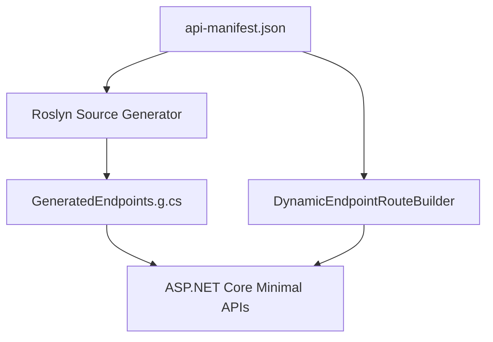
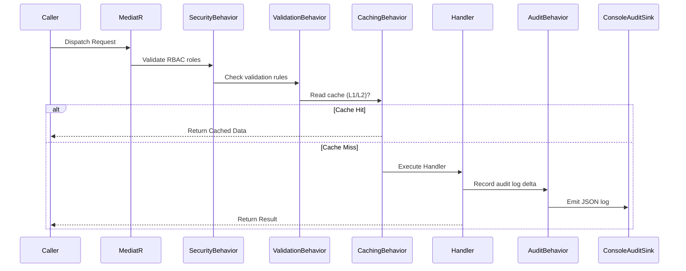

# Foundry.Api Developer Reference Manual

This document provides deep technical details on the architecture, pipelines, and extension patterns of the **Foundry.Api** framework.

---

## 1. Dynamic Endpoint Mapping Architecture

Dynamic APIs in Foundry are exposed through two distinct mechanisms working in tandem:

### A. Compile-Time Source Generation (`Foundry.Api.SourceGenerators`)
During compilation, the `ApiRouteGenerator` analyzes the structure of `api-manifest.json`:
1. It parses the JSON representation of entities and custom routes.
2. Statically emits type-safe minimal endpoint mappings (e.g. `endpoints.MapGet("/api/v1/orders", ...)`).
3. This completely bypasses runtime reflection, resulting in fast routing speeds and compatibility with **Native AOT**.

### B. Runtime Dynamic Mapping (`DynamicEndpointRouteBuilder`)
Fallback endpoint mapping is orchestrated by `DynamicEndpointRouteBuilder` at startup. It maps endpoints using expression tree compilations:
- Maps query parameters directly to entity property search expressions using LINQ expressions.
- Compiles custom advanced filtering criteria (combining `And`/`Or`/`Not` logic dynamically).

---

## 2. MediatR Request Validation & Execution Pipeline

All dynamic routing requests dispatch through a unified MediatR CQRS pipeline. The execution flow is governed by standard pipeline behaviors:

### A. Security Validation (`SecurityBehavior`)
- Resolves caller claims from the registered `ICurrentUserContext`.
- Compares claims against allowed RBAC roles configured in the manifest metadata. If unauthorized, returns a `403 Forbidden` response.

### B. Validation Execution (`ValidationBehavior`)
- Scans registered FluentValidation `IValidator<T>` rules matching request models.
- Halts execution and returns a structured validation error payload (HTTP 400) if checks fail.

### C. Cache Orchestration (`CachingBehavior`)
- Utilizes L1 (In-Memory) and L2 (Distributed Cache e.g. Redis) caches for query endpoints.
- Evicts keys matching affected collections upon command mutations (Insert, Update, Delete) to guarantee consistency.

### D. Audit Trail Telemetry (`AuditBehavior`)
- Post-execution wrapper capturing transaction outcomes.
- Invokes registered `IAuditSink` (e.g., `ConsoleAuditSink`) to output structured JSON mutation records.

---

## 3. Database Schema Migrations Engine

To handle structural entity alterations cleanly in production:
1. **Migrations Registry**: Subclasses of `DatabaseMigration` represent schema versions (e.g. `Migration_V1_Initial.cs`).
2. **Execution Runner**: `MigrationRunner.cs` checks the current version logged in the MongoDB `SchemaHistory` collection, executing pending migrations before the HTTP server starts.
3. **Mock/Testing Protection**: Includes a connection timeout guard, allowing integration testing setups with mock databases to skip migrations execution cleanly instead of hanging.
